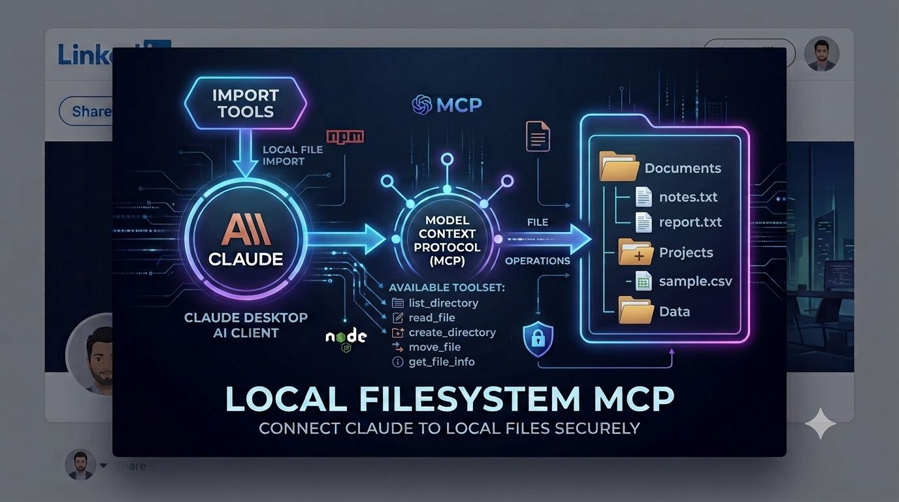
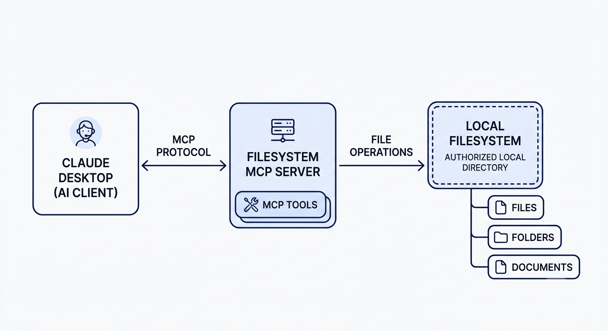
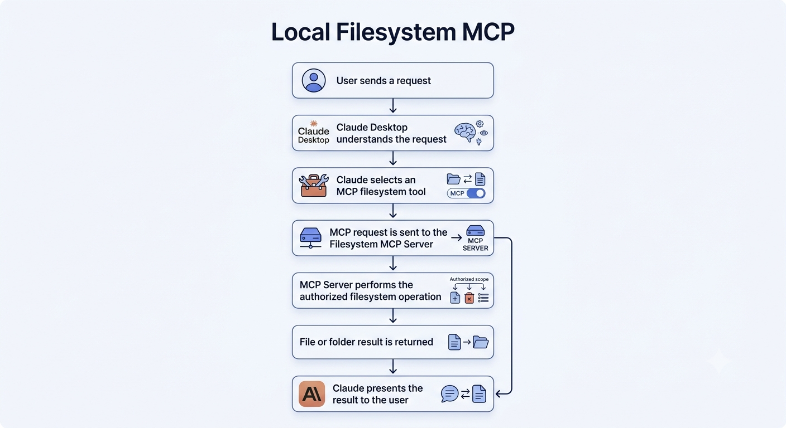

# 📁 Local Filesystem MCP

### Claude Desktop + Model Context Protocol + Local Filesystem



A practical **Model Context Protocol (MCP)** project that connects **Claude Desktop** to a local filesystem through an MCP server.

This project demonstrates how an AI assistant can interact with local files and folders through controlled **MCP tools**, enabling AI-to-tool communication through a standardized protocol.

---

## 🚀 Project Overview

The **Local Filesystem MCP** project demonstrates how an AI assistant can interact with a computer filesystem using the **Model Context Protocol**.

Instead of giving an AI application unrestricted access to the operating system, the MCP server exposes controlled filesystem capabilities that Claude can invoke when required.

### Key Capabilities

* 📂 List files and directories
* 📄 Read files
* 📝 Create files
* ✏️ Write and modify files
* 🔧 Perform filesystem operations through MCP tools
* 🤖 Connect Claude Desktop with external tools
* 🔐 Restrict access to authorized directories

---

## 🧠 What is Model Context Protocol?

**Model Context Protocol (MCP)** is a standardized protocol that allows AI applications to connect with external tools, resources, and data sources.

In this project, MCP acts as the communication layer between **Claude Desktop** and the **local filesystem**.

```text
Claude Desktop
       │
       │ MCP Protocol
       ▼
Filesystem MCP Server
       │
       │ File Operations
       ▼
Authorized Local Filesystem
```

---

## 🏗️ Architecture



### Architecture Components

**Claude Desktop**

The AI assistant that understands the user's request and determines when a filesystem tool is required.

**MCP Protocol**

The communication layer used to send tool requests between Claude Desktop and the MCP server.

**Filesystem MCP Server**

The server exposes filesystem capabilities as MCP tools and executes authorized operations.

**Authorized Local Filesystem**

The files and directories that the MCP server is permitted to access.

---

## 🔄 Workflow



The system follows this workflow:

```text
User Request
     ↓
Claude Desktop
     ↓
Select MCP Tool
     ↓
Filesystem MCP Server
     ↓
Authorized File Operation
     ↓
Tool Result
     ↓
Claude Desktop
     ↓
User
```

### Example

A user can ask Claude:

```text
Create a file called project-notes.txt
and write my project notes into it.
```

Claude identifies that a filesystem operation is required, invokes the appropriate MCP tool, and the MCP server performs the authorized operation.

---

## 🛠️ Technologies Used

| Technology             | Purpose                           |
| ---------------------- | --------------------------------- |
| Claude Desktop         | AI assistant and MCP client       |
| Model Context Protocol | AI-to-tool communication          |
| Filesystem MCP Server  | Filesystem tool provider          |
| Python                 | Server/runtime environment        |
| JSON                   | MCP configuration                 |
| Git                    | Version control                   |
| GitHub                 | Source-code hosting and portfolio |

---

## 🔧 MCP Tool Concept

The MCP server exposes filesystem functionality through tools.

Typical filesystem operations may include:

```text
List Directory
Read File
Create File
Write File
Move File
Search Files
```

Claude can select an appropriate tool based on the user's request.

The exact tools available depend on the filesystem MCP implementation and configuration.

---

## ⚙️ Setup

### 1. Prerequisites

Install the required software:

* Python
* Node.js / npm
* Claude Desktop
* Git

Verify the installations:

```bash
python --version
node --version
npm --version
git --version
```

---

### 2. Clone the Repository

```bash
git clone https://github.com/mohanraj-Ai/claude-filesystem-mcp.git
```

Navigate into the project:

```bash
cd claude-filesystem-mcp
```

---

### 3. Configure the MCP Server

Configure the filesystem MCP server in the Claude Desktop MCP configuration.

The configuration should specify:

* MCP server
* Required runtime
* Server command
* Authorized filesystem directory

Only expose directories that are intentionally required by the project.

---

### 4. Start Claude Desktop

After updating the MCP configuration:

1. Save the configuration.
2. Restart Claude Desktop.
3. Verify that the filesystem MCP server is connected.
4. Confirm that the available MCP tools are visible.
5. Test a simple filesystem operation.

---

## 🧪 Example Use Cases

### 📂 List Files

Example request:

```text
List the files in my project folder.
```

Claude can invoke the filesystem MCP tool to retrieve the directory contents.

---

### 📄 Read a File

Example request:

```text
Read the README.md file.
```

Claude can call the appropriate filesystem tool and return the requested file contents.

---

### 📝 Create a File

Example request:

```text
Create a file named notes.txt and write
today's project notes into it.
```

Claude can invoke the filesystem tool to create the requested file.

---

## 📸 Real Project Screenshots

The following screenshots demonstrate the actual working implementation.

### 1. MCP Server Running

The MCP server is running and ready to handle filesystem tool requests.


---

### 2. Claude File Operation

Claude Desktop communicates with the MCP server and performs a filesystem operation.


---

### 3. File Created

The requested file is successfully created through the MCP filesystem integration.


---

## 🔐 Security Considerations

Filesystem MCP integrations should use controlled directory access.

### Recommended Practices

* ✅ Expose only required directories
* ✅ Avoid exposing the entire system drive
* ✅ Avoid exposing credentials
* ✅ Avoid exposing `.env` files
* ✅ Avoid exposing SSH keys
* ✅ Review MCP tool permissions
* ✅ Use a dedicated project directory when possible

For example:

```text
❌ C:\

❌ C:\Users\<username>\

✅ E:\AI-Projects\MCP\
```

The objective is to provide the AI assistant with **controlled tool access**, rather than unrestricted operating-system access.

---

## 🎯 Skills Demonstrated

This project demonstrates practical experience with:

* Model Context Protocol
* AI tool calling
* AI agent architecture
* Claude Desktop integration
* MCP server integration
* Filesystem automation
* Tool-based AI workflows
* JSON configuration
* Python
* Git & GitHub
* AI system security concepts

---

## 💡 Why MCP Matters

Traditional LLM applications primarily generate responses from information available inside the conversation.

MCP allows AI applications to interact with external systems through standardized tools.

### Traditional LLM

```text
User
 ↓
LLM
 ↓
Text Response
```

### AI + MCP

```text
User
 ↓
AI Assistant
 ↓
Tool Selection
 ↓
MCP
 ↓
External System
 ↓
Tool Result
 ↓
AI Response
```

This enables AI systems to move beyond text generation toward **tool-using and agentic workflows**.

---

## 🔮 Future Improvements

Potential extensions for this project include:

* [ ] GitHub MCP integration
* [ ] Database MCP integration
* [ ] Web-search MCP
* [ ] REST API MCP tools
* [ ] Authentication and authorization
* [ ] Logging and monitoring
* [ ] Multiple MCP server integration
* [ ] Agent orchestration
* [ ] MCP Desktop Extensions / MCPB

---

## 📂 Project Structure

```text
claude-filesystem-mcp/
│
├── README.md
├── LICENSE
│
├── banner.png
├── architecture.png
├── workflow.png
│
├── screenshots/
│   ├── 01-mcp-server-running.png
│   ├── 02-claude-file-operation.png
│   └── 03-file-created.png
│
├── src/
│   └── ...
│
├── config/
│   └── ...
│
└── examples/
    └── ...
```

---

## 👨‍💻 Author

### Mohanraj P

**AI/ML Engineer | Generative AI Engineer | LLM, RAG & AI Agents**

Interested in building practical AI systems using:

* Generative AI
* Large Language Models
* AI Agents
* Model Context Protocol
* RAG Systems
* LangChain
* LangGraph
* Machine Learning
* Automotive AI

---

## ⭐ Portfolio Project

This project is part of my hands-on **Generative AI and Agentic AI portfolio**, demonstrating how AI applications can interact with external tools and systems through the **Model Context Protocol**.

If you find this project useful, consider giving the repository a ⭐.
